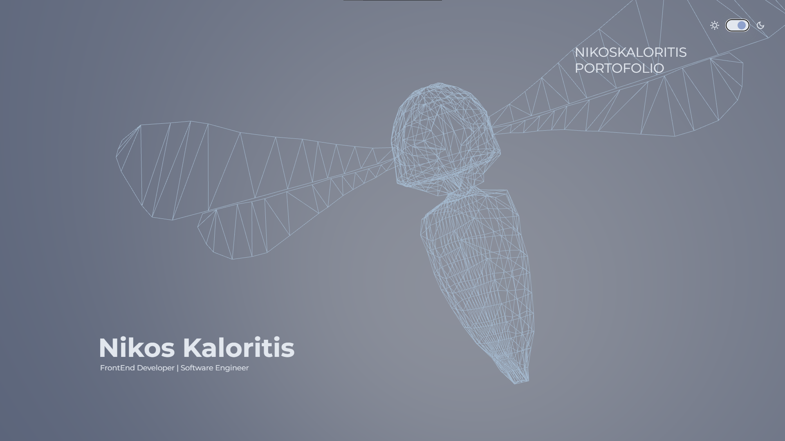
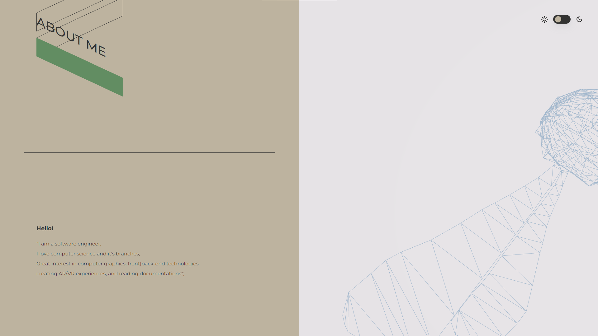
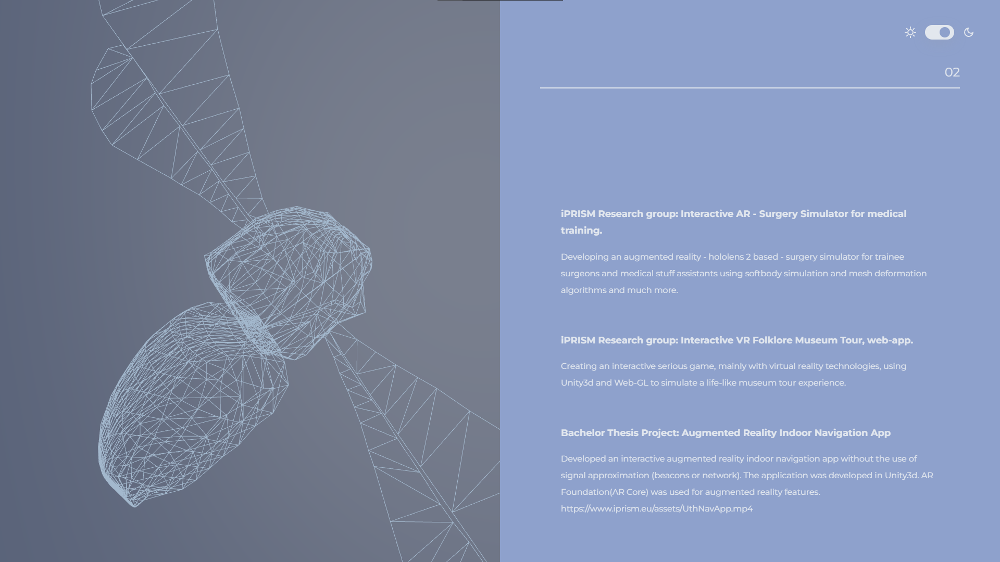

This is a personal website based on awwwards sites. I used three.js for the 3D Bee that is displayed on canvas gsap and asscrolling for animations and smooth scrolling. This project is a playground to learn more about front-end technologies, javascript and three.js deploying a site etc. as well as learning how to structure a project in a singleton pattern.

 
 
 
 

